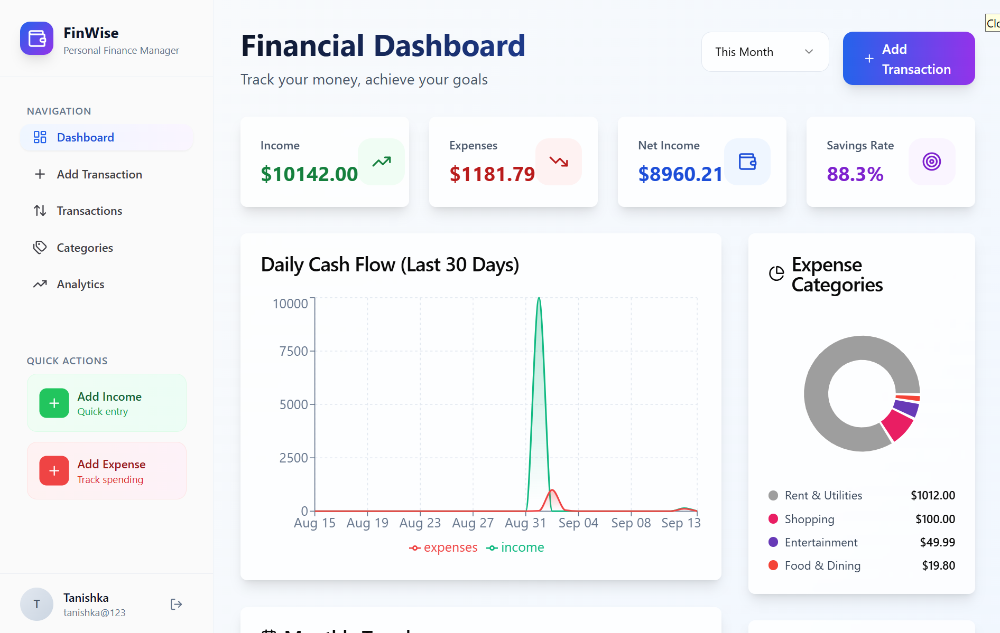
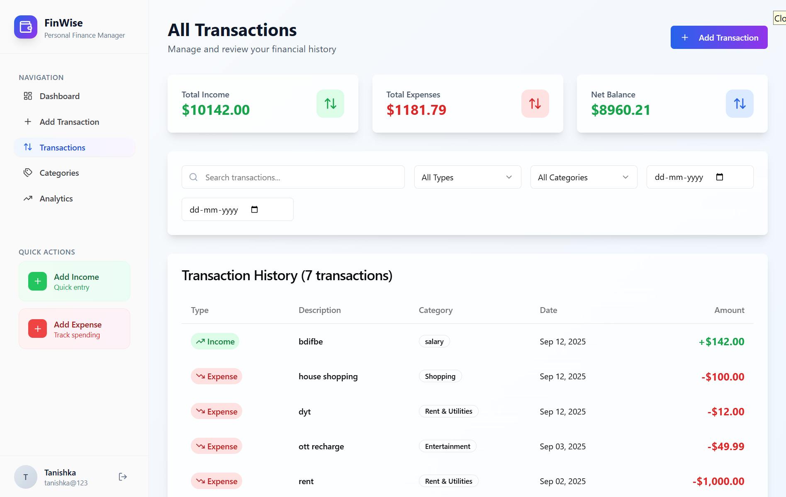
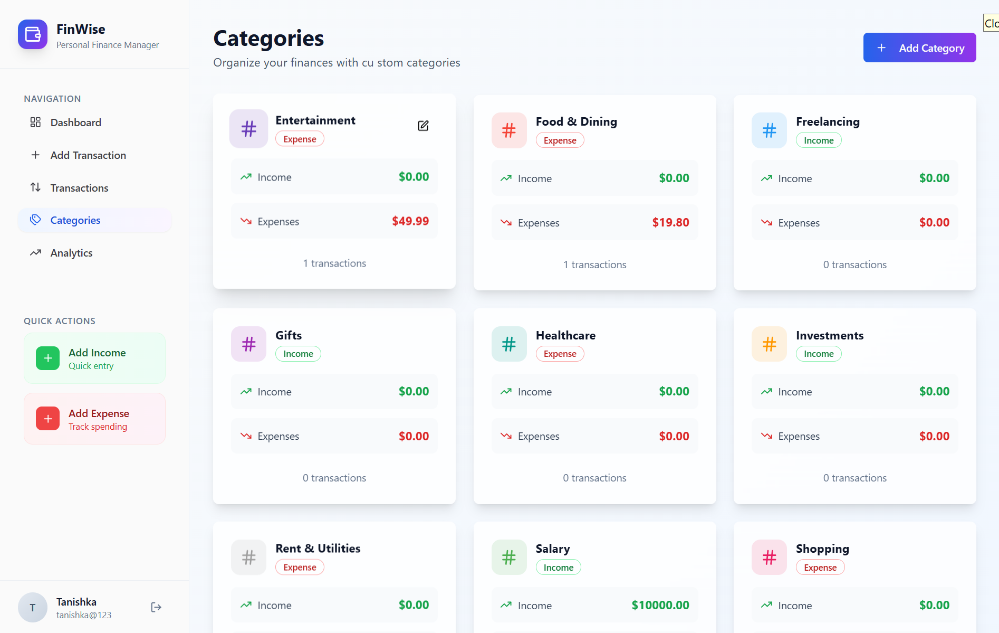
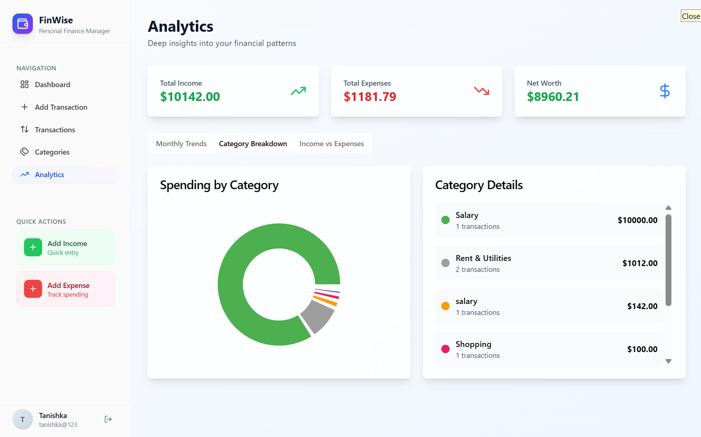

# 💰 FinWise
A comprehensive Personal Finance Management System built with the MERN stack (MongoDB, Express.js, React.js, Node.js). This application enables users to efficiently track income and expenses, manage categories, and monitor financial health through an intuitive web interface.

## ✨ Features
🔐 **Secure Authentication**: JWT-based login and registration with OAuth support  
📊 **Transaction Management**: Create, categorize, and track income/expense transactions  
📈 **Interactive Dashboard**: Visual overview of financial metrics and recent activity  
🏷️ **Category System**: Create custom categories with colors and spending limits  
📱 **Responsive Design**: Mobile-friendly interface using Tailwind CSS  
📉 **Analytics & Charts**: Monthly trends and category breakdowns using Recharts  
🔍 **Advanced Filtering**: Filter transactions by date, category, and type  
⚡ **Real-time Updates**: Instant updates across all components  

## 🛠️ Tech Stack
| Technology | Purpose |
|------------|---------|
| MongoDB | NoSQL database for data storage |
| Express.js | Backend web framework |
| React.js | Frontend user interface |
| Node.js | Backend runtime environment |
| Tailwind CSS | Utility-first CSS framework |
| JWT | Authentication & authorization |
| Recharts | Chart library for data visualization |
| Axios | HTTP client for API requests |

## 📸 Screenshots
| Dashboard | Transactions |
|-----------|--------------|
|  |  |

| Categories | Analytics |
|------------|-----------|
|  |  |

## 🚀 Getting Started

### Prerequisites
- Node.js (v16 or higher)
- MongoDB (local installation or MongoDB Atlas account)
- npm or yarn package manager

### Installation

1. **Clone the repository**
   ```bash
   git clone https://github.com/yourusername/finwise.git
   ```

2. **Set up the backend**
   ```bash
   cd backend
   npm install
   ```

3. **Configure environment variables**
   
   Create a `.env` file in the backend directory:
   ```env
   PORT=5001
   MONGO_URI=your_mongodb_connection_string
   JWT_SECRET=your_jwt_secret_key
   CLIENT_URL=http://localhost:3000
   ```

4. **Start the backend server**
   ```bash
   npm run server
   ```

5. **Set up the frontend**
   ```bash
   cd ../frontend
   npm install
   ```

6. **Start the frontend application**
   ```bash
   npm start
   ```

The application will be available at `http://localhost:3000`

## 📁 Project Structure
```
finwise/
├── frontend/               # React frontend
│   ├── public/
│   ├── src/
│   │   ├── components/     # Reusable UI components
│   │   ├── pages/          # Page components
│   │   ├── contexts/       # React context providers
│   │   └── App.js          # Main application component
│   └── package.json
├── backend/                # Express backend
│   ├── models/             # MongoDB schemas
│   ├── routes/             # API route definitions
│   ├── controllers/        # Request handlers
│   ├── middleware/         # Authentication middleware
│   ├── config/             # Database configuration
│   └── server.js           # Server entry point
└── README.md
```

## 🎯 Core Functionality

### Transaction Management
- Create detailed income and expense records
- Categorize transactions with custom categories
- Add notes and descriptions to transactions
- Track transaction history with timestamps

### Financial Analytics
- Monthly income vs expense trends
- Category-wise spending breakdown
- Savings rate calculation
- Visual charts and graphs

### Authentication
- Secure user registration and login
- JWT token-based session management
- Protected routes and user sessions

## 🔮 Future Enhancements
- [ ] **Budget Planning**: Set monthly budgets and track spending limits
- [ ] **Recurring Transactions**: Automated recurring income/expense entries
- [ ] **Data Export**: Export financial data to CSV/PDF formats
- [ ] **Mobile App**: Native mobile application for iOS and Android
- [ ] **Bank Integration**: Connect with bank accounts for automatic transaction import
- [ ] **Investment Tracking**: Track investment portfolios and returns
- [ ] **Bill Reminders**: Set reminders for upcoming bills and payments
- [ ] **Multi-Currency**: Support for multiple currencies with exchange rates
- [ ] **Financial Goals**: Set and track financial goals and milestones

## 🤝 Contributing
Contributions are welcome! Please feel free to submit a Pull Request. For major changes, please open an issue first to discuss what you would like to change.

1. Fork the project
2. Create your feature branch (`git checkout -b feature/AmazingFeature`)
3. Commit your changes (`git commit -m 'Add some AmazingFeature'`)
4. Push to the branch (`git push origin feature/AmazingFeature`)
5. Open a Pull Request

## 📄 License
This project is licensed under the MIT License - see the LICENSE file for details.

## 👨‍💻 Author
- GitHub: [Ashish Sinsinwal](https://github.com/AshishSinsinwal)
- LinkedIn: [Ashish Sinsinwal](https://www.linkedin.com/in/ashish-sinsinwal-a31b48318/)

## 🙏 Acknowledgments
- Thanks to the MERN stack community for excellent documentation and resources
- Tailwind CSS team for the utility-first CSS framework
- Recharts team for the beautiful charting library
- MongoDB for providing an excellent NoSQL database solution

---
**Built with ❤️ using the MERN stack**
